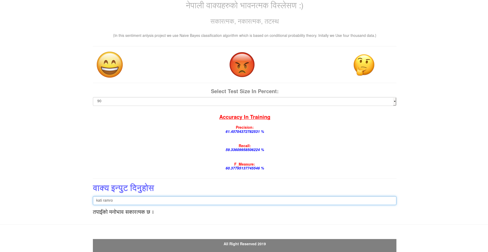
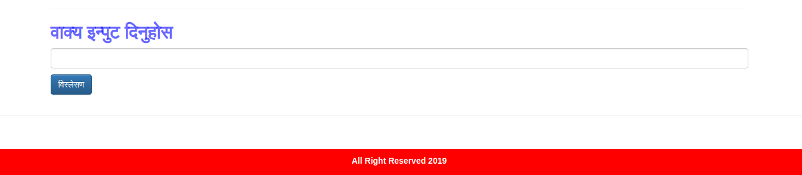

# Sentiment Analysis Of European Football

This is sentiment Analysis of nepali text using core python programming language using naive byes classification algorithm.

I am only using 100 data for initial stage  collect from different nepali news site and facebook comment.
I make this project using DjangoFrameWork

Let's take example :
## कती राम्रो घडी [positive]

##कती नाम्रो सामन्[negative]

##ठिकै हो[neutral]  

# Requirements
* Python2.7 or more
* pip install django
* setup Django Project
* pip install  requests
* pip install  pickle

## Some ScreenShots

